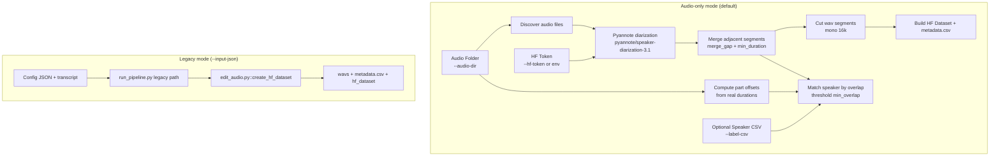

# Unified Audio Dataset Pipeline

## Tong quan

`run_pipeline.py` hien co 2 mode:

1. **Audio-only mode (mac dinh moi)**
   - Input: folder audio (`--audio-dir`)
   - Tu diarization bang pyannote
   - Map speaker theo `data_label_by_hand.csv` (neu co)
   - Khong can transcript/config json

2. **Legacy mode**
   - Input: `--input-json config_*.json`
   - Su dung transcript marker + `segment_original`
   - Giu nguyen logic cu de backward compatible

## Kien truc



## Audio-only data flow

1. `run_pipeline.py` chay mode moi khi **khong co** `--input-json`.
2. Doc audio tu `--audio-dir` theo `--audio-pattern`.
3. Khoi tao pyannote 1 lan, diarize tung file, merge segment.
4. Tinh `audio_offset_map` tu tong duration cac part cung group (`^(.+)_(\d+)$`).
5. Match speaker theo timeline CSV:
   - `abs_start = start_sec + offset`
   - `abs_end = end_sec + offset`
   - overlap >= `--min-overlap` (default 0.70)
6. Cat tung segment thanh `wavs/*.wav`.
7. Xuat `metadata.csv` schema toi gian + `hf_dataset/`.

## Command

### Audio-only (default)
```bash
python run_pipeline.py \
  --audio-dir outputs \
  --output-dir my_dataset \
  --dataset-name vn_voice \
  --label-csv data_label_by_hand.csv
```

### Legacy
```bash
python run_pipeline.py \
  --input-json config_test.json \
  --output-dir my_dataset \
  --dataset-name vn_voice \
  --label-csv data_label_by_hand.csv
```

## Output schema (audio-only mode)

`metadata.csv` / HF dataset columns:

- `segment_id`
- `audio`
- `duration`
- `start_sec`
- `end_sec`
- `abs_start_sec`
- `abs_end_sec`
- `source_file`
- `diarization_speaker`
- `speaker_label`
- `speaker_id`
- `speaker_name`
- `speaker_gender`
- `speaker_region`
- `speaker_position`
- `overlap_ratio`

Rules:
- Khong su dung transcript trong mode moi.
- `speaker_label = speaker_name` neu map CSV thanh cong; nguoc lai la nhan diarization.
- `speaker_id = 0` neu unknown.
- `segment_id = {audio_stem}_{index:04d}`.

## File chinh

- `run_pipeline.py`: entrypoint unified (legacy + audio-only)
- `src/pyannote_diarization.py`: token, convert wav 16k, pyannote diarization, merge segment
- `src/audio_only_dataset.py`: batch process audio-only, map speaker, export metadata/HF
- `edit_audio.py`: logic legacy
